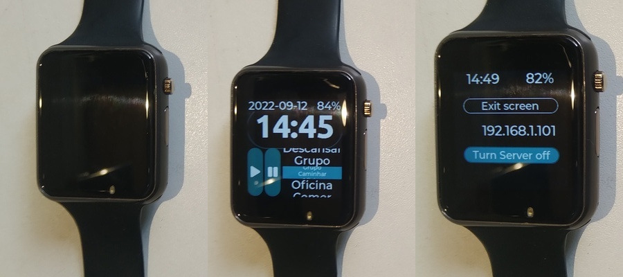
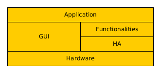
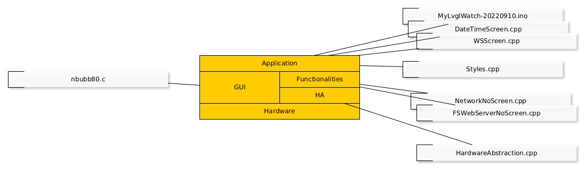

.. MyLVGLWatch documentation master file, created by
   sphinx-quickstart on Fri Sep  9 16:56:25 2022.
   You can adapt this file completely to your liking, but it should at least
   contain the root `toctree` directive.

Welcome to MyLVGLWatch's documentation!
=======================================

   
   Figure 1: watch *sleeping* (leftmost), displaying time (center), in data transfer state (right) 

What is this?
-------------

This is a personal activity logger (PAL) built on a programmable wristwatch. 

The watch owner selects, through watch's touchscreen, what activity is starting. The selected activity, date and time of the activity are logged. The log can be seen on any device with a web browser and wifi connection. (Detailed information in `How to use the personal activity logger`).

It is a sort of DIY device (no warranties and some work to get it going 🙂 ).

How to use the personal activity logger
------------------------------------------

PAL more frequent state is screen off, counting time, waiting for the owner to touch its screen (Figure 1 - right). It is, in some sense, *sleeping*. By touching the screen it turns on, displaying time.

In display time state (Figure 1 - center), screen brightness can be improved by touching on time. Clicking *play* button inserts a *rodar* activity in the log. Clicking *pause* button inserts a *esperar* activity in the log. Other activities may be selected on the rolling menu at the right of the buttons. After selecting an activity, click on it to insert it in the log. There is an information bar, displaying date and battery charge, at the top of the screen. Touching it will switch the watch to the data transfer state.

In data transfer state (Figure 1 - left) there is a button to exit the screen (back to display time screen), a text (more precisely an IP address) and a button to toggle transfer mode on/off. With *transfer mode on*, PAL tries to connect do *NameOfNetworkTP* network with password *0123456789*. Upon connection, the watch's IP address is displayed as text. In this state, another device (e.g. desktop), connected to the same network, can access the activity log by typing ``IP/eventLog.csv`` (e.g. 192.168.1.101/eventLog.csv) in the address bar of its web browser. The activity log can be copied (downloaded) to the desktop, opened in a spreadsheet and its contents can be studied.

Data transfer mode demands a lot from the battery. I recommend using it for as short as possible time, or plugging the watch to its charger.

About the meaning of the activity names
^^^^^^^^^^^^^^^^^^^^^^^^^^^^^^^^^^^^^^^

The text (tag) for each activity entry in the log is embedded in the source-code. The tags are listed below.

List of activity tags (Brazilian Portuguese as in the initial release): Rodar (play button), Esperar (pause button), Caminhar, Oficina, Comer, Casa, Passear, Comprar, Exercitar, Descansar, Grupo.

List of activity tags (English translation): Ride (play button), Wait (pause button), Walk, Office, Eat, Home, Stroll, Shop, Exercise, Rest, Group.

Activity text is named *tag* because its meaning is not fixated. It is convenient that tag text relates to its meaning, though.

In a particular use a more precise meaning is possible:

.. list-table:: more precise meaning for the tags.
   :header-rows: 1
   
   * - tag (EN)
     - tag (pt-BR)
     - meaning
   * - Ride (play button)
     - Rodar (play button)
     - Ride a vehicle (to a known place)
   * - Wait (pause button) 
     - Esperar (pause button) 
     - Wait for somthing or someone (for a vehicle, for a meeting,...)
   * - Walk 
     - Caminhar 
     - Walk to a target place (office, home, shopping area)
   * - Office 
     - Oficina 
     - Office hours (work!)
   * - Eat 
     - Comer 
     - Eat (usual meal: breakfast, lunch, dinner)
   * - Home 
     - Casa 
     - Housekeeping (do the dishes, cook, clean,...)
   * - Stroll 
     - Passear 
     - Go for a stroll, wander (without definite place to go)
   * - Shop 
     - Comprar 
     - Shop (go shopping something known in advance. Walk the shopping area is included.)
   * - Exercise 
     - Exercitar 
     - Exercise (some activity intended to physical training)
   * - Rest 
     - Descansar 
     - Rest (sleep, relax, selfcare)
   * - Group
     - Grupo
     - Group (attend a meeting, conference, class, ...) 
     
   
How to get one
--------------

with minimum downloads and tools
^^^^^^^^^^^^^^^^^^^^^^^^^^^^^^^^

- Get a TTGO T-Watch (tested with 2020 v.3) programmable watch;
- Get a desktop computer to program the watch;
- On the desktop, install ``esptool`` (this is the tool to send the program to the watch);
- On the desktop, download the files in ``bin`` (These are the personal activity annotator program in binary format);
- Connect the watch to the desktop with a USB data cable;
- Open the terminal, send the program with the command: ``python3 /home/fabio/.arduino15/packages/esp32/tools/esptool_py/3.3.0/esptool.py --chip esp32 --port /dev/ttyACM0 --baud 2000000 --before default_reset --after hard_reset write_flash -z --flash_mode dio --flash_freq 80m --flash_size 16MB 0x1000 /tmp/arduino_build_299108/MyLvglWatch-20220910.ino.bootloader.bin 0x8000 /tmp/arduino_build_299108/MyLvglWatch-20220910.ino.partitions.bin 0xe000 /home/fabio/.arduino15/packages/esp32/hardware/esp32/2.0.4/tools/partitions/boot_app0.bin 0x10000 /tmp/arduino_build_299108/MyLvglWatch-20220910.ino.bin``

with development environment installation 
^^^^^^^^^^^^^^^^^^^^^^^^^^^^^^^^^^^^^^^^^

- Get a TTGO T-Watch (tested with 2020 v.3) programmable watch;
- Get a desktop computer to program the watch;
- On the desktop, install ``Arduino IDE`` with support to ``ESP32`` board. (this is the tool to send the program to the watch);
   - some help with Arduino IDE: https://github.com/FNakano/CFA/tree/master/programas/arduinoIDE (Brazilian Portuguese)
   - some help with ESP32 support: https://github.com/FNakano/CFA/tree/master/componentes/controladores/ESP#configurar-arduinoide-para-programar-o-esp8266-ou-o-esp32 (Brazilian Portuguese) 
- On the desktop, download the files in ``src`` (These are the personal activity annotator program in binary format);
- Open the file ``MyLvglWatch20220910.ino`` with ``Arduino IDE``;
   - it probably will move the files to a new folder;
- Connect the watch to the desktop with a USB data cable;
- In tools menu select port (e.g. /dev/ttyACM0);
- In boards menu select ``TTGO T-Watch``;
- In tools menu select partition scheme: Large SPIFFS;
- In tools menu select ESP32 Sketch Data Upload;
   - this will send data (web pages) to your watch;
- Click on the arrow button;
   - this compiles the source-code and sends the binaries through USB.

Nuts and bolts
--------------

Here is the geek part.

PAL can be seen (modeled) as a stack of layers, each layer representing some object(s) and/or implementing some funtionality. This model can be adopted as a *design principle*, which may result in better organized source-code.

As a convention, layers near to the physical device are placed below and layers near to the application program are placed above. The bottom layer represents hardware. It aggregates touch sensor, hardware button, accelerometer, speaker, microphone, screen, power management unit and microcontroler (with embedded wifi, bluetooth, real-time clock and ultra low power processor). 

Above the hardware layer, as much as necessary software (program) layers can be stacked. 

In this particular design there is a Graphical User Interface (GUI) layer. It abstracts out display and touch-screen hardware details and provide graphical objects (containers, buttons, text, menus, ...).  It is implemented with LVGL (https://lvgl.io).

These two layers are provided, by their respective developers, packed in a product: TTGO T-Watch (http://www.lilygo.cn/prod_view.aspx?TypeId=50053&Id=1380&FId=t3:50053:3). The example programs (I learned a lot from them) are provided in Arduino IDE and from https://github.com/Xinyuan-LilyGO/TTGO_TWatch_Library.

Besides GUI layer, I defined a Hardware Abstraction (HA) Layer to group/encapsulate hardware details and provide a cleaner interface to the hardware.

PAL funcionalities with no screen associated, such as networking, web serving, date/time adjusting are grouped in a funcionalities layer.

Finally, screen definition (graphical objects styling, placing, navigating, event handling) are built Over GUI and HA layers and comprise an application layer.

   
   Figure 2 - Layer model of PAL. 

Source-code explained
^^^^^^^^^^^^^^^^^^^^^

The layer model is implemented in source-code files. Relation between layers and files is provided in Figure 3.

   
   Figure 3 - Relation between source-code files and layers of PAL. 

Directory tree

.. raw:: html

   <pre><b>.</b>
   ├── config.h
   ├── <b>data</b>
   │   ├── <b>edit.htm.gz</b>
   │   ├── favicon.ico
   │   ├── <b>graphs.js.gz</b>
   │   └── index.htm
   ├── DateTimeScreen.cpp
   ├── DateTimeScreen.h
   ├── FSWebServerNoScreen.cpp
   ├── FSWebServerNoScreen.h
   ├── HardwareAbstraction.cpp
   ├── HardwareAbstraction.h
   ├── MyLvglWatch-20220910.ino
   ├── MyLvglWatch-20220910.ino.twatch.bin
   ├── nbubb80.c
   ├── NetworkNoScreen.cpp
   ├── NetworkNoScreen.h
   ├── Styles.cpp
   ├── Styles.h
   ├── WSScreen.cpp
   └── WSScreen.h
   </pre>

One screen defining file (e.g. DateTimeScreen.cpp) should contain functions that implement one screen, its graphical objects, associate the objects to callback function (event handling functions), data refreshing (if necessary) and insert tasks into the LVGL event loop.

One functionality defining file (e.g. FSWebServerNoScreen.cpp) should contain functions that implement related functionalities, getters for information generated in the functionality that should be presented in some screen and initialize,start,finish functions to be calle by a screen defining function. A functionality file should not expose its implementation details (e.g. provide a pointer to an internal variable).

One hardware abstraction function (or file e.g. HardwareAbstraction.cpp) should provide all desired functionality of a specific hardware component while hiding implementation details (e.g. I2C bus initialization and message exchange).

How to improve the program
^^^^^^^^^^^^^^^^^^^^^^^^^^

Create screens in its own files (e.g. DateTimeScreen.cpp), create funcionalities in its own files (e.g. FSWebServerNoScreen.cpp) , abstract out hardware details (e.g. ``static TTGOClass *ttgo``, control variables, private functions and data types) into ``HardwareAbstraction.cpp``.

For further information, check out the Library API and the source-code in github repository: https://github.com/FNakano/MyLVGLWatch.

Important notes
^^^^^^^^^^^^^^^

LVGL implements its own event loop based on cooperative multitasking, which is necessary and sufficient to deal with events and tasks. It is adviced, on its documentation, that preemtively interrupting LVGL functions may cause malfunction. Something I would interpret as: *LVGL functions are not thread-safe*. Consequently (for me), LVGL and FreeRTOS should not be used together. So do LVGL and AsyncWebServer.

Still on event loops, events (and taks) are serviced through *callback fuctions*. On LVGL these should be C functions (not C++ member functions). This can be circumvented but resulting source-code has one more indirection level, making it less readable.

LVGL event loop is explicitly executed in ``loop()`` function of ``.ino`` file.

API documentation generated with ``exhale``, ``doxygen``, ``breathe`` and ``sphinx``.

.. toctree::
   :maxdepth: 2
   :caption: Contents:

   about
   api/library_root

My documentation project milestones
-----------------------------------

- Target zero: know what is this;
- Target 1: deploy the test explained above;
   - binaries and esptool (fastest if you don't have Arduino IDE installed and configured - just try this test case on your watch);
   - Arduino IDE, source-code download, compile and deploy (recommended if you want to program the watch);
- Target 2: explain what was done (and the underlying ideas);
- Target 3: explain how to expand it;
- Target 4: explain how to create the github repository and the RTD documentation

Indices and tables
==================

* :ref:`genindex`
* :ref:`modindex`
* :ref:`search`

Instructions to build binaries: https://randomnerdtutorials.com/bin-binary-files-sketch-arduino-ide/

Folder containg binaries: `bin`

Send binaries to the watch: python3 /home/fabio/.arduino15/packages/esp32/tools/esptool_py/3.3.0/esptool.py --chip esp32 --port /dev/ttyACM0 --baud 2000000 --before default_reset --after hard_reset write_flash -z --flash_mode dio --flash_freq 80m --flash_size 16MB 0x1000 /tmp/arduino_build_299108/MyLvglWatch-20220910.ino.bootloader.bin 0x8000 /tmp/arduino_build_299108/MyLvglWatch-20220910.ino.partitions.bin 0xe000 /home/fabio/.arduino15/packages/esp32/hardware/esp32/2.0.4/tools/partitions/boot_app0.bin 0x10000 /tmp/arduino_build_299108/MyLvglWatch-20220910.ino.bin 

The source-code repository is: https://github.com/FNakano/MyLVGLWatch

References to ReST: https://www.sphinx-doc.org/en/master/usage/restructuredtext/basics.html#images, 

References to source-code documentation: https://doxygen.nl/manual/docblocks.html

References to emojis: https://gist.github.com/rxaviers/7360908, https://github.com/ikatyang/emoji-cheat-sheet, https://github.com/konveyor/pelorus/pull/320

emojipedia: https://emojipedia.org/

